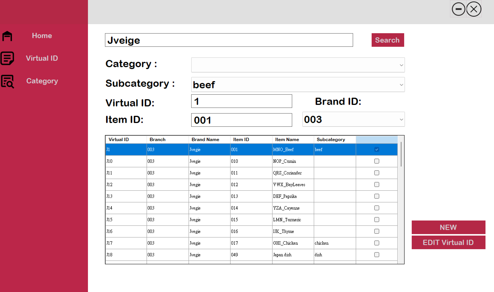
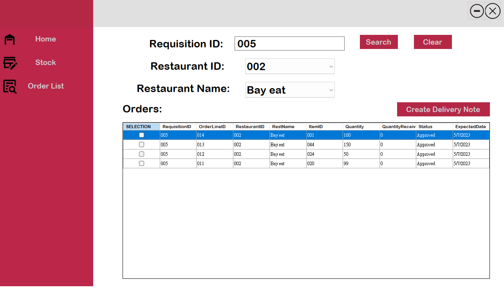
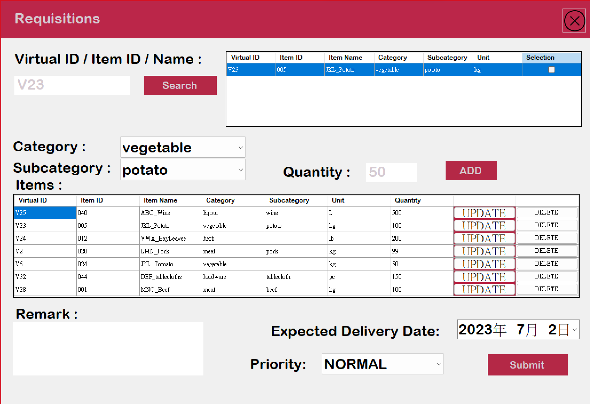
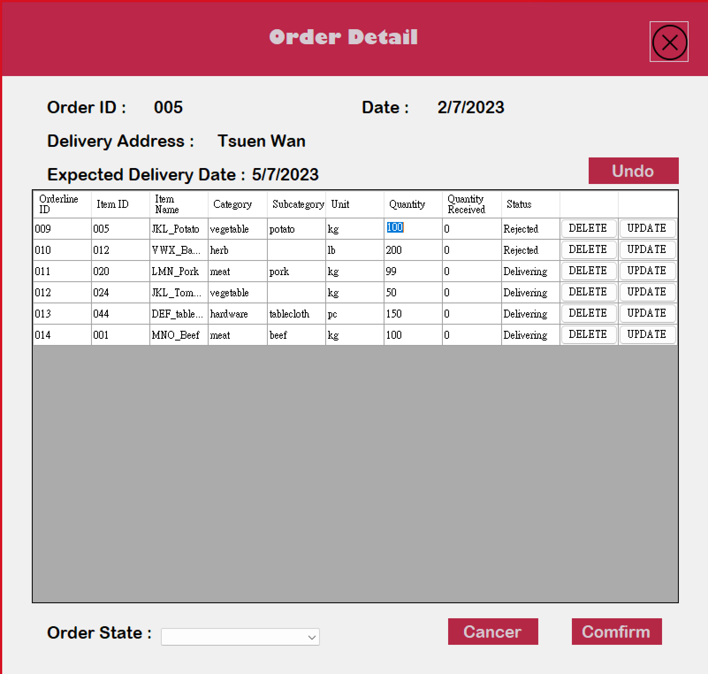
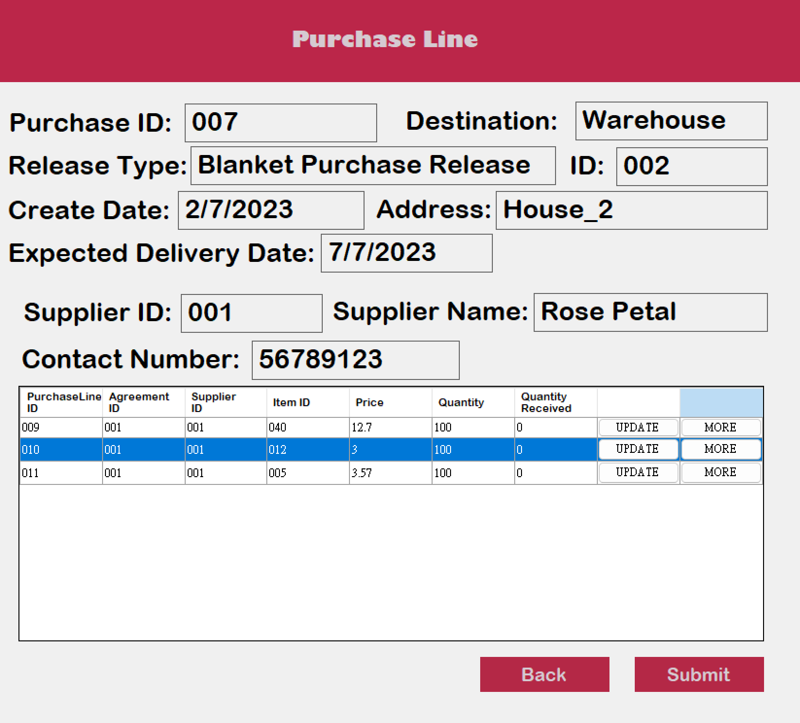
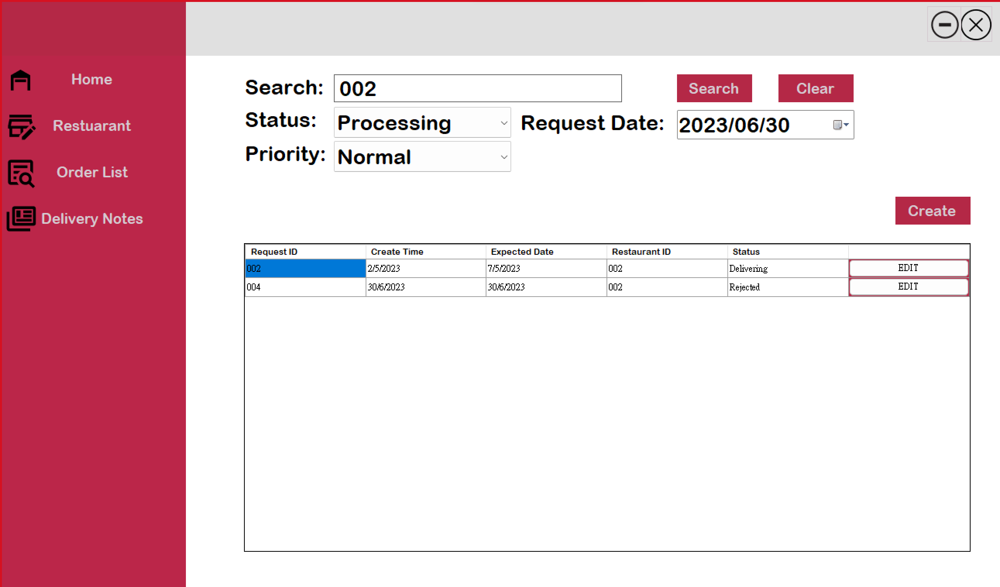
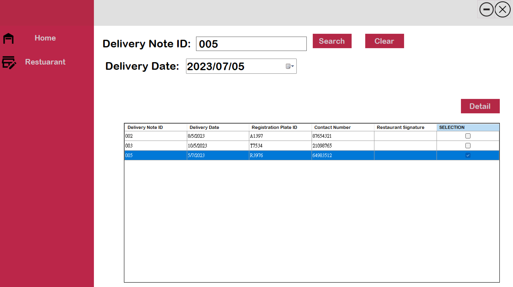
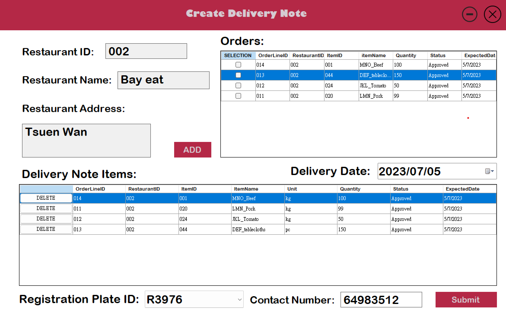
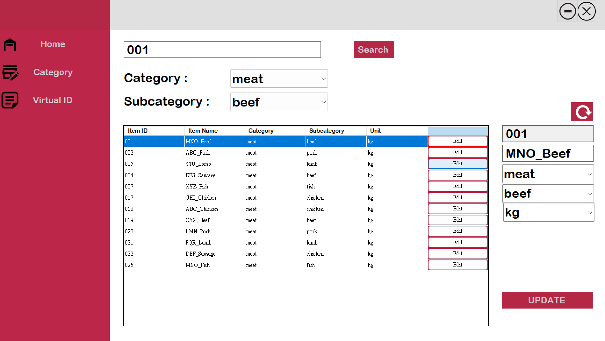
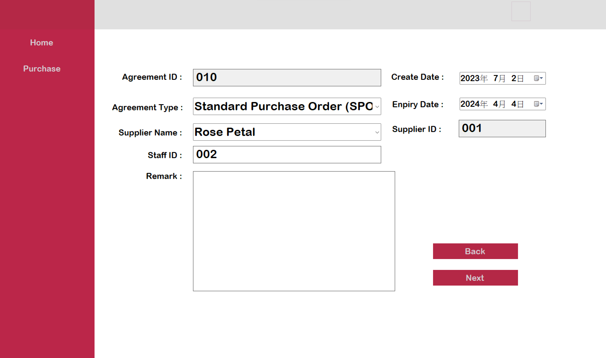

# ITP4915M-Assignment
# Centralized Procurement System

## Table of Contents
- [Overview](#overview)
- [Key Features](#key-features)
- [Benefits](#benefits)
- [User Roles and Responsibilities](#user-roles-and-responsibilities)
- [Getting Started](#getting-started)
- [Project Images](#project-images)

## Overview
The Centralized Procurement System is a user-friendly software application designed to streamline the procurement process for Yummy Restaurant Group, a large catering company. This system enhances operational efficiency, reduces costs, and improves data consistency across the organization.

## Key Features
- **Centralized Order Management**: Restaurant managers can easily place orders through a centralized database, minimizing input errors and miscommunication between departments.
  
- **Purchase Agreement Mapping**: The system automatically aligns orders with existing purchase agreements and available warehouse stock, ensuring compliance and optimizing procurement.

- **Inventory Management**: Real-time tracking of stock levels allows the system to automatically update quantities after orders are placed or received.

- **Delivery Scheduling**: Warehouse clerks can efficiently schedule and manage stock deliveries based on restaurant requests, reducing miscommunication.

- **Invoicing and Accounting**: The system calculates invoice balances and sends them for auditing, enhancing data consistency and reducing overhead.

## Benefits
- **Improved Visibility and Decision-Making**: A centralized view of operations enables better-informed decisions and quicker responses to market changes.

- **Reduced Overhead Costs**: Automation of repetitive tasks, such as order processing and invoicing, lowers labor costs and boosts efficiency.

- **Enhanced Data Consistency**: A centralized database ensures accurate and reliable data, minimizing discrepancies and errors.

- **Increased Supplier Collaboration**: Effective management of purchase agreements and inventory tracking strengthens supplier relationships and optimizes procurement strategies.

- **Improved Customer Satisfaction**: Timely order deliveries and better inventory management lead to higher service quality and customer satisfaction.

## User Roles and Responsibilities
The Centralized Procurement System supports various user roles, each with specific responsibilities:

- **Restaurant Manager**: Places orders, tracks order status, and manages delivery schedules.
  
- **Purchase Manager**: Manages purchase agreements, maps orders to available stock, and arranges deliveries.

- **Purchase Clerk**: Assists the Purchase Manager with order mapping and delivery scheduling.

- **Warehouse Clerk**: Updates inventory levels, creates delivery notes, and records received shipments.

- **Category Manager**: Manages product categories and virtual item IDs.

- **Accounting Manager**: Updates purchase order status and verifies invoices.

- **Accounting Clerk**: Verifies and approves invoices before processing payments.

## Getting Started
To begin using the Centralized Procurement System, follow these steps:

1. **Check Requirements**: Ensure your computer meets the minimum hardware and software requirements.
  
2. **Install Software**: Install necessary components, including the .NET Framework and SQL Server (or MS Access).

3. **Log In**: Use your assigned user credentials to log in to the system.

4. **Familiarize Yourself**: Explore the user interface and functionalities relevant to your role.

5. **Attend Training**: Participate in training sessions to learn how to effectively use the system.

6. **Seek Support**: Contact the IT support team for any technical assistance or questions.

## Project Images

  

  

  

  

  

  

  

  

  

  

  

<p
